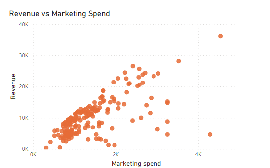
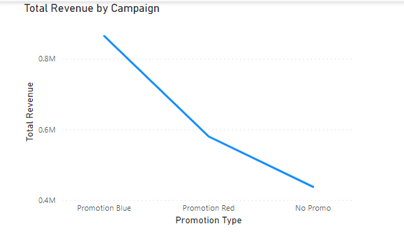
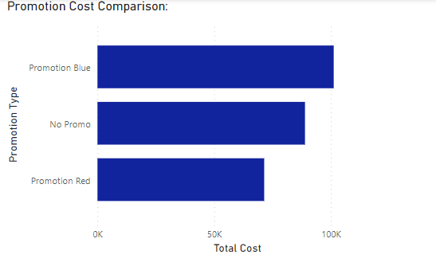
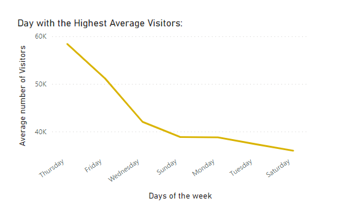

# Power BI Data Visualization

The scatter plot illustrates the relationship between marketing spend and revenue. Each data point represents a specific observation, where the x-axis denotes the marketing spend, and the y-axis represents the corresponding revenue generated. The plot aims to visualize any potential correlation between marketing expenditure and revenue outcomes. A positive correlation would suggest that higher marketing spending leads to increased revenue, while a lack of correlation or a negative correlation may indicate inefficiencies in marketing strategies.

This visualization presents the total revenue generated by each campaign, with campaign types represented along the x-axis and the corresponding total revenue displayed on the y-axis. The chart provides a comprehensive overview of revenue performance across different campaigns.

The bar chart compares the revenue generated by different promotion types, such as "No Promo," "Promotion Blue," and "Promotion Red." Each bar represents the total revenue attributed to a specific promotion type. This visualization facilitates a clear comparison of revenue performance across different promotional campaigns.

The line chart displays the average number of visitors per day over a certain period, with each day represented along the x-axis and the corresponding average visitor count along the y-axis. The line chart visually highlights fluctuations in average visitor numbers across different days of the week.